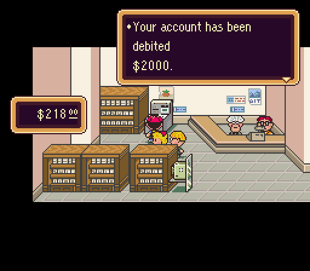

# Control Flow

## Description

Create a program that mimics an ATM. From the REPL, it should be possible to start it up using `ATM.run()`.

## Requirements

* Prompt me for my name
  * If I enter nothing, throw an exception
* Prompt me for what I would like to do
  * 1. Check my balance, 2. Withdraw Funds or 3. Cancel
  * Check Balance
    * Print to the console `"Your balance is $100"`
  * Cancel
    * Print to the console `"Thank you and please come again."`
  * Withdraw Funds
    * Prompt for how much money to withdraw
      * If the amount is greater than 100, throw an exception
      * If all is well, tell them to please take their money
