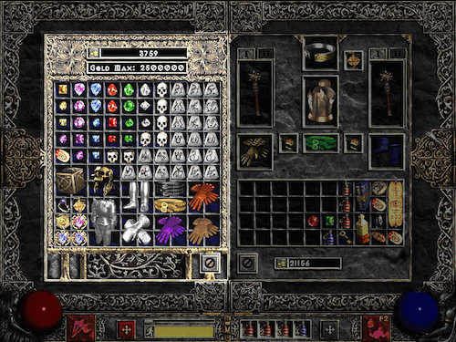

# Review



## Description

Create a program to track items in an inventory. It should allow you to add an item, remove an item, and change the quantity they have in stock.

## Requirements

* Create a class with a `main` method.
* Create a variable to store the inventory items.
* Print out the inventory items and then list the options.
* If the user enters `1`, let them create a new item by entering its name.
* If the user enters `2`, let them remove an item by its number.
* if the user enters `3`, let them update the quanitity of that item.
* Optional: Create a login system with a few hard-coded usernames and passwords.

## Sample Output

```bash
1. [10] Apples
2. [5] Pears
3. [7] Bananas
Options:
[1] Create a new item
[2] Remove an item
[3] Update an item's quantity
```
