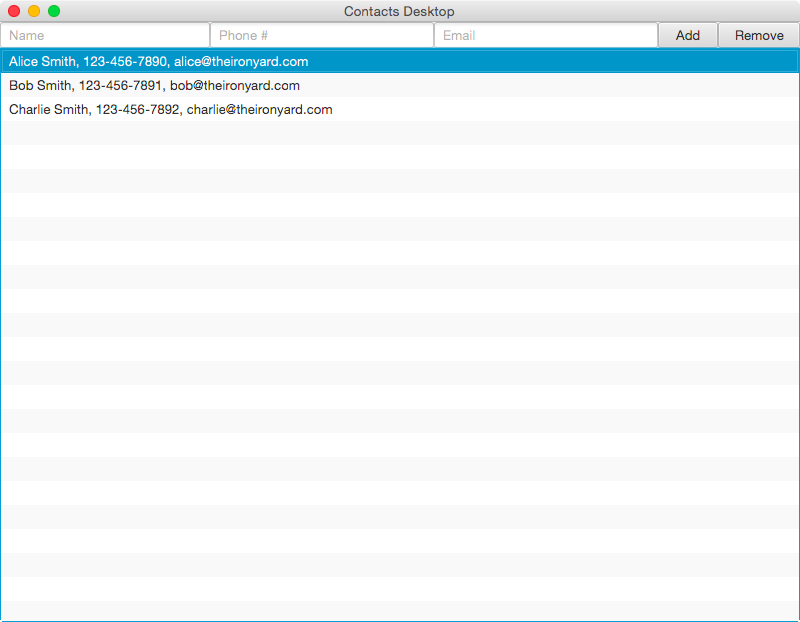

# JavaFX

## Description

Create a desktop app for managing contacts.

## Requirements

* Create a project called "ContactsDesktop" using IntelliJ's JavaFX template.
* Edit `Main.java` so the title bar says "Contacts Desktop" and the window starts at 800x600.
* Create a UI that looks like the screenshot below.
* Create a class called `Contact` to store a name, phone, and email (all strings).
  * Override the `toString` method so it prints the contact like "Alice Smith, 814-867-5309, alice@theironyard.com".
* Create a data structure for your `Contact` objects in `Controller.java`.
  * `ObservableList<Contact> contacts = FXCollections.observableArrayList();`
* Create fields in `Controller.java` for all the controls (remember `@FXML`).
* Make `Controller.java` implement `Initializable`.
* In your `initialize` method, call the list view's `setItems` method to make it use `contacts`.
* When the "Add" button is clicked, create a new `Contact` object and add it to `contacts`.
* When the "Remove" button is clicked, remove the selected `Contact` object from `contacts`.
* Don't add a new contact if any of the three fields are blank.
* Optional
  * Save the contacts to a file (either JSON or custom format, your choice) whenever a contact is added or removed.
  * Load that file in the `initialize` method in `Controller.java`, parse it, and populate the `contacts` with it.

