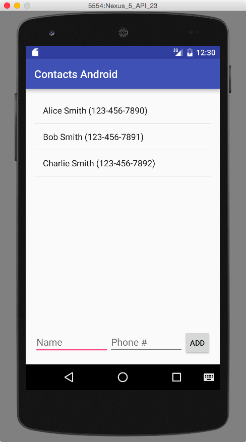

# Android

## Description

Create an Android app for managing contacts.

## Requirements

* Create a UI that looks like the screenshot below.
  * To make the two text boxes take up an even amount of space:
    * Put a `LinearLayout (Horizontal)` at the bottom of the app
    * Put the two text fields and button inside of it
    * Click the two text fields and set `layout:width` to 0 and `layout:weight` to 1.
* Create variables for each of the controls in `MainActivity`.
* In `onCreate`, use `findViewById` to connect the variables to their respective views.
* Create an `ArrayAdapter<String>` and connect the listview to it.
* Implement `View.OnClickListener`.
* In `onClick`, pull the name and phone strings from the text fields, combine them into one string, and add them to the adapter. Then make it clear the text fields.
* Implement `AdapterView.OnItemLongClickListener` and make `onItemLongClick` remove the item that was long-clicked.

