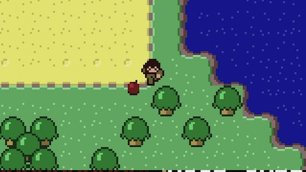

# libGDX

## Description

Create a libGDX project called `Minicraft`. Then download [minicraft-assets.zip](https://github.com/oakes/java-assignments/raw/master/curriculum/assets/minicraft-assets.zip) and put its contents in `core/assets`. Write the necessary code to make the player walk around.

## Requirements

* Make the player move via the arrow keys.
* Make the game draw the correct sprite (down, up, left, right) based on which direction you are going.
* When the player walks past an edge of the screen, make it appear at the opposite edge. For example, if it walks off the right edge of the screen, it should appear on the left edge.
* Optional:
  * Animate the player's movement. When moving up or down, you can just flipping the tile horizontally. When moving left or right, you can switch between the standing and running tiles.
  * Bring in the zombie tiles to draw a bad guy that walks around randomly.
  * Draw a green background, then bring in the tree tile and draw it randomly in the background.
