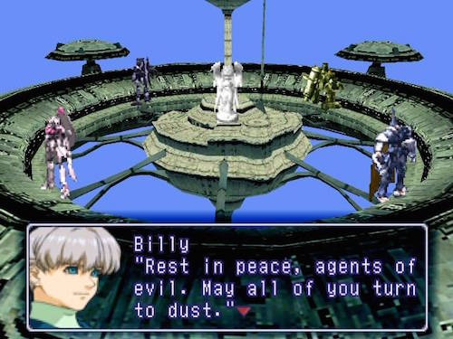
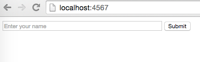
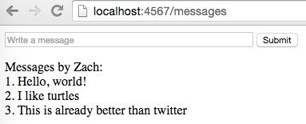

# Microblog

## Description

Make a web application that allows you write short messages. When you click "Submit", it will refresh and show a list of messages you wrote.

## Requirements

* Add the Spark and Mustache libraries in Project Structure.
  * `com.sparkjava:spark-core:2.3`
  * `com.sparkjava:spark-template-mustache:2.3`
* Create a `resources` folder in Project Structure and mark it with the "Resources" designation.
* Create a `public` and `templates` folder inside of it.
* Create `resources/public/index.html` which looks like in the first screenshot below.
* In your `main` function, make Spark serve `public` as static files.
* Create a GET route for "/messages" and a POST route for "/create-user" and "/create-message".
* When the user hits submit in "index.html", it should post the name to "/create-user" which saves it in a user object and redirects to "/messages".
* Create `resources/templates/messages.html` which looks like the second screenshot below. It must display the name given by the user, and use Mustache templating to list the messages written by the user.
* When the user hits submit in "messages.html", it should post the text to "/create-message" which saves it in an `ArrayList<Message>` and redirects to "/messages" (i.e. refreshes the page).
* Optional: In "index.html", add a password field. If the user doesn't exist, have it behave like usual; if it does exist, then check the password and return an error if it is wrong.
* Optional: Add styling with CSS.

