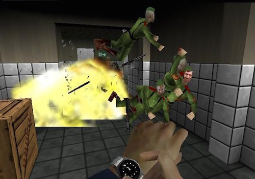
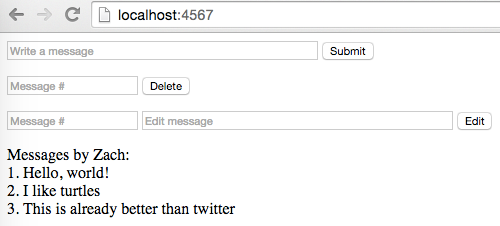

# Microblog Continued

## Description

Add functionality to your microblog.

## Requirements

* Get rid of the `User` class entirely. We will be storing the user's name inside the `Session` object from now on.
* In the `/create-user` route, get the `Session` object and save the username there using the `attribute` method.
* Instead of serving `messages.html` from a separate route, serve it right from the `/` route if the user is logged in.
  * Move `index.html` into `resources/templates`.
  * Change the `/messages` route to just be `/`.
  * Wherever you are redirecting to `/messages`, you should now redirect to `/`.
  * In the new `/` route, serve up `index.html` if there is no username in the session (i.e., the user isn't logged in). Refer to the `/` route in BeerTracker.
* Show the messages as a numbered list (the first message should have a `1.` next to it and so on).
* Add a form in `messages.html` which lets you delete a message by entering its number.
* Add a form in `messages.html` which lets you edit a message by entering its number and the text you want to replace it with.
* Optional: Add multi-user support by storing your users in a `HashMap<String, User>` and putting your `ArrayList<Message>` inside the `User` object.

