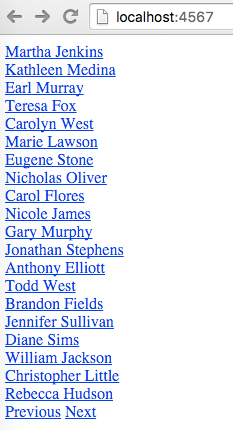
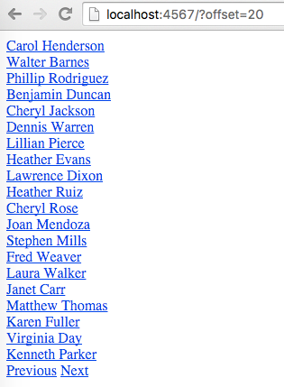

# Paging

## Description

Fork the [PeopleWeb](../projects/PeopleWeb) project. In this project, we're reading a CSV file full of data about people and parsing it into an `ArrayList<Person>`. Make the project use Spark to display this data in a large list. Once you are successfully displaying it, figure out how to make it show only 20 people at a time. You should provide a "Next" link at the bottom so the user can view the next 20 people in the list. It should be possible to cycle through all the users this way.

## Requirements

* Parse the CSV file into an `ArrayList<Person>`.
* Create a GET route for `/` that simply lists the names of each person in `ArrayList<Person>`. It should only display 20 names, and should have a "Previous" and "Next" button at the bottom *only if necessary* (don't show the "Previous" button on the first page, and don't show the "Next" button on the last page). It should take a GET parameter which is the offset it is supposed to start at, like this: `/?offset=20`.
* Create another GET route called `/person` which displays all the data about a single person. It should take a GET parameter which is the id for that person, like this: `/person?id=1`
* Make all the people shown on the main page link to their `/person` page, so I can click on their names for additional information.

