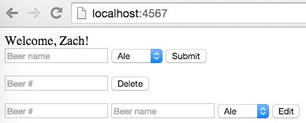

# SQL Basics

## Description

Fork the GameTracker project we made in class. Modify it to store its information in an H2 database. Add an edit form which updates the relevant item in the database. The final app should look like the screenshot below.

## Requirements

* Create the `Connection` and execute a query to create a `games` table that stores the game name and other attributes.
* Write a static method `insertGame` and run it in the `/create-game` route. It should insert a new row with the user-supplied information.
* Write a static method `deleteGame` and run it in the `/delete-game` route. It should remove the correct row using `id`.
* Write a static method `selectGames` that returns an `ArrayList<Game>` containing all the games in the database.
* Remove the global `ArrayList<Game>` and instead just call `selectGames` inside the "/" route.
* Add a form to edit the game name and other attributes, and create an `/edit-game` route. Write a static method `updateGame` and use it in that route. Then redirect to "/".
* Optional: Add a search form which filters the game list to only those games whose name contains the (case-insensitive) search string.

