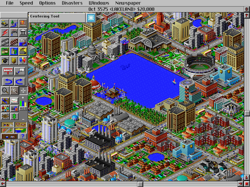
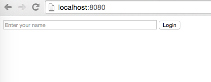
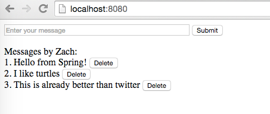

# Microblog

## Description

Make a web application that allows you write and delete short messages. When you click "Submit", it will refresh and show a list of messages you wrote. If you're feeling *déjà vu*, it's because this is the same assignment we did two weeks ago, but this time we're doing it with Spring.

## Requirements

* Create a project from the Spring template
  * Go to [Spring Initializr](https://start.spring.io/)
  * Choose "Gradle Project"
  * Group is `com.theironyard` and artifcat is `MicroblogSpring`
  * Click "Switch to the full version"
  * Check the following options:
    * Web
    * Mustache
    * PostgreSQL
  * Download and unzip the project
  * Import into IntelliJ
  * Choose "Import project from external model" and select Gradle
  * Click Next and Finish
* Create `home.html` in the templates directory
  * It should display a login form like the first screenshot
* Create a controller class next to the main application class
* In your controller, create a route for `/`
  * It should take the model and the request as arguments
  * It should read the username from the session and add it to the model
  * It should return the home template
* In your controller, create a route for `/login`
  * It should take the request and the username as arguments
  * It should save the username to the session
  * It should return a redirect to `/`
* In `home.html`, use Mustache tags to conditionally show the markup in the two screenshots below
  * If `username` doesn't exist, show the login form like the first screenshot
  * If `username` does exist, show the message submission form and message list like the second screenshot
* Create a `Message` class next to your other classes
  * It should have fields for `id` and `text`
* Create an `ArrayList<Message>` in your controller to store submitted messages
* In your controller, create a route for `/add-message`
  * It should take the message text as an argument
  * It should create a `Message` object and add it to the arraylist (for the id, do something like `messages.size() + 1`)
  * It should return a redirect to `/`
* In `home.html`, add a button or link called "Delete" next to each message
  * It will need to send the id as a parameter
* In your controller, create a route for `/delete-message`
  * It should take the message id as an argument (the type should be `Integer`)
  * It should remove the message with the given id (do something like `messages.remove(id - 1)`)
  * It should return a redirect to `/`

